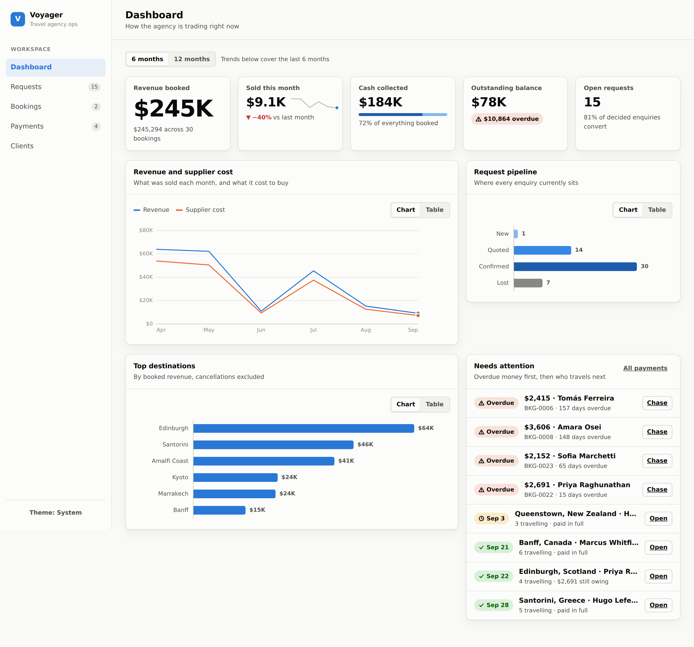

# Voyager — travel agency dashboard

An operations dashboard for a travel agency: capture enquiries, turn the won ones
into bookings, and track the money against each booking until it is settled.



## What it does

| Screen | Purpose |
| --- | --- |
| **Dashboard** | Revenue, cash collected, outstanding and overdue balances; monthly revenue-vs-cost trend; the request pipeline; top destinations; and an attention list of overdue payments and imminent departures. |
| **Requests** | Every enquiry from `new` → `quoted` → `confirmed`/`lost`, with search and status filters. A won enquiry converts to a booking in one step. |
| **Bookings** | Confirmed travel with supplier, sell price, margin and outstanding balance. Each booking has a detail page with its full payment schedule. |
| **Payments** | Deposits, balances and refunds across all bookings, filterable by status or by what is overdue. One click marks a payment received. |
| **Clients** | Contact details plus request count, booking count and lifetime value. |
| **Flight search** | A **Search flights** button on any request drives an airline site with Playwright, reads the published fares, and returns them in one standard shape. It never books. |
| **Quotations** | Apply markup to searched fares, price them in IQD with a USD equivalent, and send the customer a quotation they can confirm. Employees see cost, markup and profit; customers never do. |
| **Orders** | A customer confirms a quotation and it becomes a booking request with its price locked. Employees see passengers, payment state, ticketing status and the full history. |
| **Settings** | Exchange rates, IQD rounding, default markup and quote validity — all administrator-editable. |

## Running it

Requires **Node 22.5+** (the API uses the built-in `node:sqlite` module, so there
is no native database dependency to compile).

```bash
npm install
npm run seed     # creates server/data/agency.db with ~6 months of sample data
npm run dev      # API on :4000, Vite dev server on :5173
```

Open <http://localhost:5173>. The dev server proxies `/api` to the API process.

For a production-style run, build the SPA and let the API serve it:

```bash
npm run build
npm start        # whole app on http://localhost:4000
```

Other scripts: `npm run typecheck`, `npm test` (the flight-search suite), and
`npm run seed` at any time to reset the database to a known state.

## How it is put together

```
server/          Express API over SQLite (node:sqlite), plain ESM — no build step
  src/db.js          schema, migrations and query helpers
  src/validate.js    field validation; every failure becomes a 400 with a message
  src/routes/        clients · requests · bookings · payments · overview · flights
  src/automation/    the flight-search module (see below)
  src/pricing/       settings, exchange rates, and the pure pricing engine
  src/quotes/        quotation service: build, reprice, status, customer view
  src/messaging/     WhatsApp message builder (sending is a separate concern)
  src/orders/        confirmation, the order status machine, passenger profiles
  src/booking/       authorized booking channels, and the pre-ticketing re-check
  src/mock-airline/  a fictional airline site the tests drive
  src/seed.js        deterministic sample data
web/             Vite + React + TypeScript
  src/lib/           API client, types, formatting, status→tone mapping
  src/components/    UI primitives, stat tiles, hand-rolled SVG charts
  src/pages/         one file per screen
```

### Money is stored in cents

Every amount is an integer number of minor units, end to end. Totals and balances
are summed in SQL as integers, so a booking's outstanding balance never drifts the
way repeated floating-point addition does. Only the UI divides by 100 to format.

### Balances are derived, never stored

A booking's `paid_cents` is computed from its settled payments (money in minus
refunds out) and its balance is `sell − paid`. Nothing has to be kept in sync
after the fact, so a payment edit can never leave a stale balance behind. Cancelled
bookings report a zero balance rather than an amount nobody will ever collect.

### Converting a request is one transaction

`POST /api/requests/:id/convert` writes the booking, optionally schedules the
deposit, and flips the request to `confirmed` inside a single transaction. If any
part fails the whole thing rolls back, so there is no half-converted request. A
request that already has a booking is rejected rather than duplicated.

## Flight search automation

The first automation module searches **one airline** and returns standardized
results. It reads published fares and nothing else — it never books, never holds
a seat, and never enters payment details.

### The workflow

1. An employee creates a request with origin, destination, dates, passenger
   counts by type (adult/child/infant) and cabin class.
2. They press **Search flights** on that request.
3. The server queues a job, opens Chromium, enters the search on the airline's
   site, and waits for results.
4. Rows are parsed, normalized, and stored against the request.
5. The dashboard shows airline, flight number, departure and arrival times,
   duration, stops, baggage allowance (where displayed), the price as displayed,
   and the currency.

### When it stops

The module stops and reports **"Human intervention required"** rather than
attempting to get past anything. It never solves a CAPTCHA, never signs in,
never spoofs a user agent, and ships no stealth or fingerprint patching — it
browses as ordinary automation and stands down when a site says no.

| Reason | Meaning |
| --- | --- |
| `CAPTCHA_PRESENTED` | A CAPTCHA or human check appeared |
| `LOGIN_REQUIRED` | Fares are behind a sign-in |
| `ACCESS_BLOCKED` | Bot protection or rate limiting (401/403/429, block text) |
| `UNEXPECTED_PAGE` | Not the page the adapter expects |
| `RESULTS_NOT_FOUND` | Results never rendered, or none could be parsed |
| `NAVIGATION_FAILED` | The site could not be reached |
| `UNRESOLVED_AIRPORT` | Origin or destination did not match an airport |
| `CABIN_NOT_AVAILABLE` | The carrier does not sell the requested cabin |
| `BROWSER_UNAVAILABLE` | Chromium is not installed on the server |

Each stop stores the URL the automation was looking at, a screenshot, and
plain-English guidance, so the employee can finish the search by hand.

An empty result set is deliberately *not* an intervention: "this route has no
flights on these dates" is a real answer, and is reported as a completed search
with zero offers. Rows that are found but cannot be parsed **are** an
intervention — reporting zero fares there would be a lie.

### Adding or fixing an airline

Adapters live in `server/src/automation/adapters/`. Each one is a small object:
a URL builder, an optional form filler, a "results are ready" wait, and a
selector map. Everything else — the guard, the normalizer, the queue, the
persistence and the UI — is shared and does not change when a site does.

```
FLIGHT_SEARCH_ADAPTER=mock   # which adapter is offered by default
MOCK_AIRLINE_URL=...         # point the mock adapter elsewhere
SEARCH_NAV_TIMEOUT_MS=30000
SEARCH_RESULTS_TIMEOUT_MS=25000
```

### ⚠️ The live adapter is unverified

The bundled **easyJet** adapter was written without access to the live site (the
build environment cannot reach airline domains), so **its URL shape and every
selector are a starting point, not a verified contract**. Open a real search,
inspect the DOM, and correct `SELECTORS` and `buildSearchUrl` in
`adapters/easyjet.js` before trusting its output. Until then it will most likely
report `RESULTS_NOT_FOUND`, which is the intended failure mode — it does not
invent fares.

The **mock** adapter and its bundled airline (`Northwind Air`, a fictional
carrier) are fully verified and are what the test suite drives, so the pipeline
itself — form entry, parsing, normalization, every intervention path, storage
and display — is proven end to end.

**Before pointing this at a real airline, check that automated access is
permitted.** Most airline terms of service restrict scraping, and that is a
question for you and your legal advisers, not something the code can settle.

### Tests

`npm test` runs 40 checks and is self-contained — it starts its own mock
airline on an ephemeral port and creates its own fixtures, so it passes on a
fresh checkout with nothing else running and no seeding. The flight-search suite drives a real browser against
the mock airline (parser edge cases, airport resolution, one-way and return
searches, cabin class affecting fares, and each stop-for-a-human path). The
pricing and quotation suites cover currency normalization, both markup methods,
IQD rounding modes, manual overrides, rate-change immutability, expiry, the
customer-projection leak check, and transaction rollback on a bad fare. The
order suite covers the price lock surviving a rate change and a reprice, expiry
blocking confirmation, passenger snapshotting, every guard in the status
machine, and automated booking channels refusing until connected.

## Pricing and quotations

Searched fares flow straight into a quotation — the employee never retypes a
flight detail.

```
Airline price  ->  normalize to USD  ->  apply agency markup
               ->  final customer price  ->  display in IQD + USD
```

### Markup

Per flight, the employee picks **a percentage of cost** or **a fixed amount**
(stated in USD or in IQD), or sets the **selling price by hand**. Whichever is
used, four numbers are always kept apart internally:

| | |
| --- | --- |
| Original airline price | exactly as the airline displayed it, in its own currency |
| Cost | that price normalized to USD at the quote's stored rate |
| Markup | the agency's addition |
| Profit | final selling price − cost |

Profit is always measured against what the customer actually pays, so IQD
rounding and manual overrides are both reflected honestly rather than showing
the margin the rule *would* have produced.

### IQD and USD

Every quotation leads with the IQD price and shows the USD equivalent beneath
it. The USD figure is derived from the rounded IQD figure, so the two lines
always agree with each other.

- The **USD → IQD rate is an administrator setting**, never a constant in the
  code, and is edited under Settings.
- **Each quotation stores the rate it was priced at.** Changing the rate later
  moves new quotations only — a price a customer has already been shown never
  changes underneath them. There is a test for exactly this.
- **IQD rounding is configurable** (step and direction; default: nearest 1,000).
- Fares in **USD, EUR, TRY, IQD or any other currency** are supported — add the
  rate under Settings. A fare in a currency with no configured rate is refused
  with a message rather than quoted at a guessed rate.

### Quotation lifecycle

```
draft -> sent -> viewed -> customer_selected -> awaiting_payment -> paid
                     \-> expired        \-> cancelled
```

`awaiting_payment` and `paid` exist in the schema and the type system but are
deliberately rejected by the API until the payment stage is built.

Expiry is derived from the stored `expires_at` rather than a flag, so a
quotation cannot sit in the database claiming to be live after its time. Once
expired, the customer sees an explanation instead of a price and **the confirm
endpoint refuses with `409 QUOTE_EXPIRED` and `requires_recheck: true`** — the
button being disabled is a courtesy, not the enforcement. An employee reprices
the quotation to re-issue it at the current rate.

### What the customer can and cannot see

The customer's copy lives at `/q/<token>` and is built from an **explicit
allow-list projection**, not by deleting internal fields from the full record.
A column added to the quotes table later cannot leak by being forgotten. The
airline's price, markup, profit, internal notes and employee details are never
assembled into that payload at all.

The customer sees: flight details, baggage, the IQD price, the USD equivalent,
the expiry, and a Confirm button. A test asserts that none of the internal
figures appear in the customer payload as keys *or* as values.

### WhatsApp

**Send to WhatsApp** generates a formatted message and a `wa.me` link the
employee sends. Message *building* is separate from message *sending*
(`src/messaging/whatsapp.js` exposes a `deliver()` seam), so a WhatsApp Business
API provider can be connected later without touching the quotation system. The
message is built from the customer projection, so it cannot contain internal
pricing either.

## Customer confirmation and orders

A customer who opens their WhatsApp link walks through three steps: choose a
flight, give traveller details, check the summary. Confirming turns the
quotation into an **order**.

### Passengers

The form collects full name, date of birth, gender, nationality, passport
number, passport expiry, issuing country, phone, optional email and passenger
type, and it seeds one card per traveller the request was priced for. More can be
added.

Travellers are saved to the customer's profile, so a returning customer picks
themselves from a list instead of typing their passport again. **Saved passport
numbers are masked on the public link** (`••••4321`) and never sent to the
browser — choosing a saved traveller returns only their id and the server reads
the real record itself. A quotation link is shareable by nature, so it is not a
place to publish passport numbers.

A passport that expires before the departure date is rejected, in the form and
again on the server.

### The price lock

Confirming freezes everything onto the order: the selling price, the exchange
rate, the markup, the full flight details and the quote expiry that was in
force. Nothing recomputes them afterwards. Changing the agency's rate, editing
the markup, or repricing the quotation moves the *quotation* and leaves the
order exactly where it was — there is a test that does precisely this and
asserts the two diverge.

An expired quotation cannot be confirmed at all: the API refuses with
`QUOTE_EXPIRED` and the flight price and availability have to be re-checked
first.

### Order lifecycle

```
draft -> quoted -> sent -> customer_confirmed -> awaiting_payment -> paid
                                      -> booking_in_progress -> booked
                                      \-> failed    \-> cancelled
```

Transitions are guarded: an order cannot jump from awaiting payment to booked,
and `booked` is terminal. Every move is written to an event trail with who did
it and why.

### Payment

**No payment gateway is connected.** Money is reconciled by a person — a
consultant records that a transfer landed, with a method and reference — which
moves the order to `paid`. That action is deliberately the exact seam a gateway
webhook will take over: when one is added it writes the same record and nothing
downstream changes.

### Booking channels

Ticketing is modelled as a pluggable **authorized channel**, not as more browser
automation. The flight-search module is a *shopping* tool: it reads published
fares from a public website. Issuing a ticket is a different act needing
ticketing authority and a channel the airline recognises.

| Channel | Automated | Status |
| --- | --- | --- |
| Agent portal (issued by staff) | no | available |
| GDS (Amadeus / Sabre / Travelport) | yes | not connected |
| NDC (direct, aggregator, or via GDS) | yes | not connected |

The automated channels are declared with their prerequisites and **refuse to
issue** until actually connected, so a deployment can never quietly believe it
booked something it did not. Today a consultant issues the ticket and records the
PNR; the order already carries everything a PNR build needs.

Before ticketing, **Re-check price & availability** runs the search module
against the airline and reports whether the fare moved, disappeared, or hit
something needing a human. It is advisory: the customer's locked price does not
change either way, and a person decides whether to absorb the difference,
re-quote, or proceed.

## The wider pipeline

This module is stage four of a longer workflow. Stages already built are marked:

```
Customer sends request                      [built]
  -> automation searches airline sites      [built - one airline]
  -> flights collected                      [built]
  -> agency markup applied                  [built]
  -> IQD + USD price generated              [built]
  -> quotation created                      [built]
  -> quotation sent via WhatsApp            [built - message; sending is manual]
  -> customer selects flight                [built]
  -> customer confirms + passengers         [built]
  -> price locked, order created            [built]
  -> customer pays                          (not built - no gateway)
  -> system detects payment                 (manual today; the seam is built)
  -> availability and price re-checked      [built - advisory]
  -> booking on an authorized channel       (channel abstraction built; GDS/NDC not connected)
  -> PNR / ticket recorded                  [built - recorded by staff]
  -> confirmation sent to customer          (not built)
```

What is deliberately absent is payment processing and automatic ticket purchase.
Everything they need already exists: the statuses, the guarded transitions, the
event trail, the locked price, the re-check step, and a booking-channel
interface with GDS and NDC declared but not connected.

## API

All endpoints live under `/api`. Amounts in and out are in cents.

| Method | Path | Notes |
| --- | --- | --- |
| `GET` | `/overview?months=6` | KPIs, monthly trend, pipeline, destinations, attention lists |
| `GET` `POST` | `/clients`, `/requests`, `/bookings`, `/payments` | list (with `q` search and `status` filter) and create |
| `GET` `PATCH` `DELETE` | `/{resource}/:id` | read, partial update, delete |
| `GET` | `/bookings/:id` | booking plus its full payment schedule |
| `POST` | `/requests/:id/convert` | create a booking (and deposit) from a won enquiry |
| `POST` | `/payments/:id/settle` | mark a scheduled payment received today |
| `GET` | `/flights/adapters` | which airlines can be searched, and which is default |
| `POST` | `/flights/requests/:id/search` | start a search; returns `202` with the job |
| `GET` | `/flights/:id` | job status plus its standardized offers |
| `GET` | `/flights/:id/evidence` | screenshot of whatever stopped the automation |
| `GET` | `/flights/requests/:id/searches` | search history for a request |
| `GET` `PATCH` | `/settings` | agency settings (rounding, markup defaults, terms) |
| `PUT` `DELETE` | `/settings/rates/:currency` | set or remove an exchange rate |
| `GET` `POST` | `/quotes` | list quotations, or build one from flight offers |
| `GET` `PATCH` | `/quotes/:id` | full internal record; change status, terms or notes |
| `PATCH` | `/quotes/:id/items/:itemId` | change a line's markup or set its price by hand |
| `POST` | `/quotes/:id/reprice` | re-base on today's rate and extend the expiry |
| `POST` | `/quotes/:id/whatsapp` | generate the customer message and `wa.me` link |
| `GET` | `/public/quotes/:token` | **customer-facing**; allow-listed fields only |
| `POST` | `/public/quotes/:token/select` | customer marks which flight they are choosing |
| `GET` | `/public/quotes/:token/passengers` | **customer-facing**; saved travellers, passports masked |
| `POST` | `/public/quotes/:token/confirm` | customer confirms with passengers; creates the order |
| `GET` `POST` | `/orders`, `/orders/:id` | booking requests with locked pricing |
| `POST` | `/orders/:id/status` | guarded status transition |
| `POST` | `/orders/:id/payment` | record that money arrived (manual reconciliation) |
| `POST` | `/orders/:id/verify` | re-check fare and availability before ticketing |
| `POST` | `/orders/:id/booking` | record the PNR and ticket numbers |
| `GET` | `/orders/channels` | which booking channels exist and which are connected |

Filters worth knowing: `/payments?overdue=true` returns everything still pending
past its due date, and `/bookings?q=` searches reference, supplier, destination,
client and confirmation code.

## Charts

The charts are hand-rolled SVG — no charting dependency — and follow one palette
throughout:

- **Colours are validated, not eyeballed.** The categorical slots, the ordinal blue
  ramp used for pipeline stages, and the status colours were each checked for
  colour-blind separation, lightness band and contrast against both the light and
  dark surfaces before being used.
- **Status never rides on colour alone.** Every badge pairs its tone with a glyph
  and a written label.
- **Every chart has a table twin.** The Chart/Table toggle on each card exposes the
  same numbers as text, so no value is reachable only by hovering.
- **Nominal categories get one colour.** Top destinations uses a single hue for all
  bars — bar length already encodes size.

Dark mode is a selected set of steps for the dark surface, not an inverted light
palette, and follows the OS setting until the sidebar toggle overrides it.

## Known limitations

- **Single currency.** Everything is USD; there is no FX handling. Multi-currency
  would need a rate per booking and a reporting currency for the dashboard totals.
- **No authentication.** Every visitor is implicitly the same agency user. Real
  deployment needs auth and per-consultant ownership before it faces the internet.
- **One airline, and its selectors are unverified.** See the warning above: the
  live adapter needs one pass against the real site before production use.
- **Searches run one at a time**, in the API process. That is deliberate (a
  browser is heavy, and hammering an airline is rude), but it means a queued
  search waits. A separate worker would be the next step.
- **Ticketing is not automated, by design.** GDS and NDC are declared channels
  but not connected; a consultant issues the ticket and records the PNR. Whether
  an agency may issue on a given carrier depends on its own ticketing authority.
- **No authentication.** "Prepared by" is a dropdown, not a login, and any
  visitor with the dashboard URL sees internal pricing. Customer quotation links
  are unguessable random tokens, which is right for a share link but is not a
  substitute for authenticating employees. Auth is the prerequisite for putting
  this on a public host.
- **The seeded exchange rates are placeholders, not market data.** Set real
  rates under Settings before quoting; the screen flags any rate over a week old.
- **Revenue is recognised when sold**, keyed on the booking's creation date, not
  when the client travels or when cash lands. The trend chart says "sold", and cash
  collected is tracked separately on its own tile.
